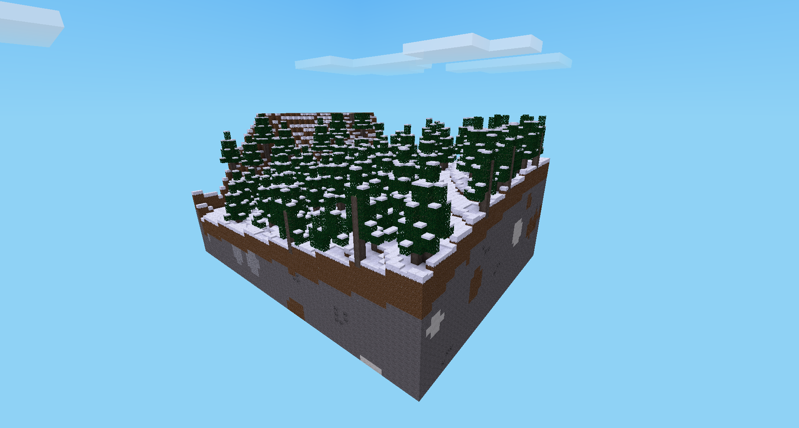

modgen mod for minetest


[](license.txt)
[](https://content.minetest.net/packages/BuckarooBanzay/modgen)

# Overview

Allows you to export a part of the map as a standalone mod which can be used as a mapgen



# Commands

* `/pos1`, `/pos2` Set opposite corners of the export map
* `/export [fast]` Exports the map as a standalone mod into `${worldfolder}/modgen_mod_export`
* `/autosave [on|off]` enables autosave feature (**warning**: may impact performance!)

# In-place saving

After an initial mod-export the resulting mod can be edited live and in-place
if the `modgen` mod is also present (optional).

To enable the saving directly into the exported mod you have to add it to the "trusted_mods" setting:

```
secure.trusted_mods = modgen
```

Afterwards if you mark a region and execute `/export` the mapblocks are written to the exported mod itself

# Obfuscating mapblock paths/coordinates

In some scenarios it can be important to obfuscate where mapblocks are generated (to make cheating harder for example).
The pattern of the mapblock filename can be customized in a depending mod.

An example:

_mod.conf_
```
depends = modgen
```

_init.lua_
```lua
function modgen.get_mapblock_name(prefix, pos, suffix, create_dirs)
  local pos_str = minetest.pos_to_string(pos)
  -- simply do a "sha1" over the position string
  -- reconstruction of the coordinate can only be achieved by hash-collision (brute-force)
  local sha_hash = minetest.sha1(pos_str)
  return prefix .. "mapblock-" .. sha_hash .. "." .. suffix
end
```

The above example will rewrite the mapblock-filenames:

```
mapblock-0ad55e954876c567f7c5629faa782bc62c5aa800.bin
mapblock-106de3dc97ac24f9500f53efe8f656f17177e154.bin
mapblock-1635341941674dee01ac10dd0b663ff2cc8fe598.bin
mapblock-25dcdb8997491affc4339ebc31536a9602b001c1.bin
```

In this case the position of the saved mapblocks isn't easily visible.
This may be helpful in maps where treasures are hidden in remote areas only accessible by teleports.

# Export format

## manifest.json

Json file that serves as an index to look up content-id's:

```json
{
  "next_id": 82,
  "node_mapping": {
    "access_cards:palm_scanner_off": 25,
    "air": 0,
    "default:chest": 53,
    "digilines:wire_std_00100000": 72
  }
}
```

## mapblocks

Mapblocks are saved in `${modfolder}/map/{x}/mapblock_{y}_{z}.bin`
**Hint**: x/y/z are the coordinates in mapblocks

The mapdata is saved and compressed with `deflate`

* 4096*2 Bytes: Node-ids for the mapblock in z/x/y order as integer MSB first
* 4096 Bytes: Param1 data
* 4096 Bytes: Param2 data

## metadata / nodetimers

Metadata and nodetimers are saved as compressed (`deflate` algorithm) json-file in `${modfolder}/map/{x}/mapblock_{y}_{z}.meta.bin`

```json
{
  "meta": {
    "(1,3,14)": {
      "fields": {
        "configured": "1",
        "key": "Level 1 Access"
      },
      "inventory": null
    },
    "(11,3,14)": {
      "fields": {
        "configured": "1",
        "key": "Biolab Access"
      },
      "inventory": null
    },
    "(13,7,10)": {
      "fields": {
        "gain": "2",
        "hear_distance": "32",
        "interval_max": "20",
        "interval_min": "20",
        "randomize_position": "0",
        "selected_sound_key": "soundblock_scifi_ambient_3",
        "state": "on"
      },
      "inventory": null
    },
    "(8,7,10)": {
      "fields": {
        "formspec": "size[8,9]list[current_name;main;0,0.3;8,4;]list[current_player;main;0,4.85;8,1;]list[current_player;main;0,6.08;8,3;8]listring[current_name;main]listring[current_player;main]image[0,4.85;1,1;gui_hb_bg.png]image[1,4.85;1,1;gui_hb_bg.png]image[2,4.85;1,1;gui_hb_bg.png]image[3,4.85;1,1;gui_hb_bg.png]image[4,4.85;1,1;gui_hb_bg.png]image[5,4.85;1,1;gui_hb_bg.png]image[6,4.85;1,1;gui_hb_bg.png]image[7,4.85;1,1;gui_hb_bg.png]",
        "infotext": "Box"
      },
      "inventory": {
        "main": [
          ""
        ]
      }
    },
    "(9,8,10)": {
      "fields": {
        "formspec": "size[8,9]list[current_name;main;0,0.3;8,4;]list[current_player;main;0,4.85;8,1;]list[current_player;main;0,6.08;8,3;8]listring[current_name;main]listring[current_player;main]image[0,4.85;1,1;gui_hb_bg.png]image[1,4.85;1,1;gui_hb_bg.png]image[2,4.85;1,1;gui_hb_bg.png]image[3,4.85;1,1;gui_hb_bg.png]image[4,4.85;1,1;gui_hb_bg.png]image[5,4.85;1,1;gui_hb_bg.png]image[6,4.85;1,1;gui_hb_bg.png]image[7,4.85;1,1;gui_hb_bg.png]",
        "infotext": "Box"
      },
      "inventory": {
        "main": [
          ""
        ]
      }
    }
  },
  "timers": {
    "(13,7,10)": {
      "elapsed": 5.200000286102295,
      "timeout": 20
    }
  }
}

```

# License

MIT
